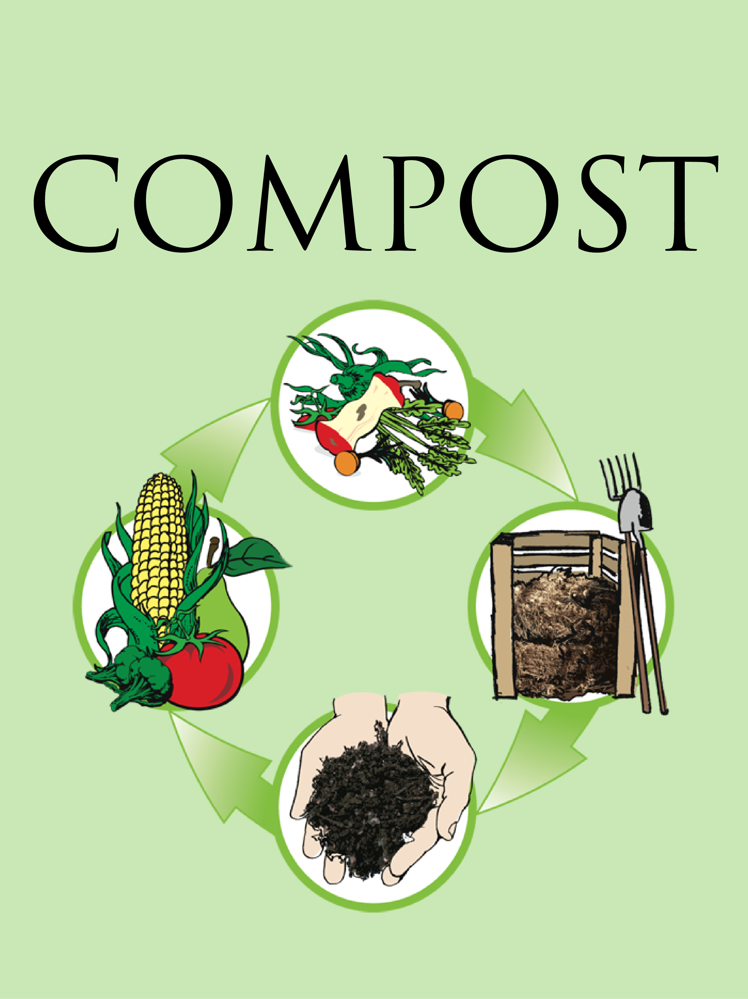

# LitterSmart

LitterSmart is a program that allows users to analyze items through video and image anaylsis to see whether it should be considered compost, trash, or recyclable.

  
  
  

## How it was made

- Python
- Google Cloud Vision API
- OpenCV2

Using opencv2 and the Google Cloud Vision API through Python, we were able to create a program that pulled in a live video feed, convert it into a series of frame images, and identify different categories for items. We first used opencv2 library to access the webcam of our computer and saved the video into a .mov file. Using this file we were able to capture still frames to analyze each component and then using the Google Cloud Vision API, analyze key features of each item. Using keywords, we were able to categorize items, whether they were considered 'Trash', 'Compost', or 'Recyclable'. We then used pygame to pop up a GUI for users to know what their item scanned to be.

## What I learned

This project was on of the first projects that was built from scratch with little to no knowledge on Python and how to use APIs. This was great exposure to how APIs can be implemented into programs to build useful applications. 